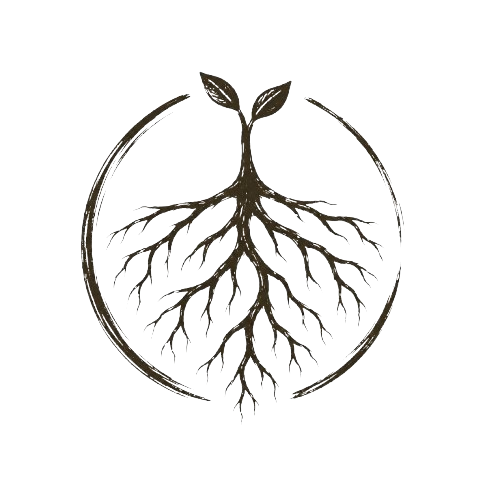

# AKAR

<p align="center">
  
</p>

**A local advisory CLI for AI-assisted software engineering.**

AKAR sits alongside Claude Code and adds structure to AI coding sessions — preflight checks, diff budget reporting, skill awareness, local telemetry, postmortems, and learning notes.

It does not write your code. It does not execute fixes. It does not edit project files. It prints advice and records what happened.

---

## What it does

- Classifies your task before the agent touches anything
- Reports a diff budget so you know the expected scope (not enforced yet)
- Detects skill conflicts (e.g. two methodology controllers active at once) and reports them
- Records local-only telemetry after each mission
- Summarises what happened and whether it went well
- Writes generic learning notes if something degraded or failed
- Prints hook installation instructions (does not install hooks automatically)

## Foundation knowledge

AKAR carries local playbooks for safe git, shell, hook, and loop behavior.

- `docs/foundation/AKAR_FOUNDATION.md` — first principles
- `docs/foundation/SAFE_GIT_PLAYBOOK.md` — allowed and forbidden git patterns
- `docs/foundation/SAFE_SHELL_PLAYBOOK.md` — blocked shell commands and safe alternatives
- `docs/foundation/CLAUDE_CODE_HOOK_PLAYBOOK.md` — hook integration guidance
- `docs/foundation/LOOP_ENGINEERING_PLAYBOOK.md` — proven AKAR session loop

Guidance from these playbooks surfaces automatically in command output:
- `akar safety "..."` — BLOCKED output includes a safe alternative
- `akar status` — BLOCKED readiness includes git dirty guidance
- `akar postmortem --diff` — EXCEEDED output includes split-task guidance
- `akar hooks --check` — FAIL output includes hook broken guidance

AKAR provides alternatives before retry. It does not execute the playbooks automatically.

---

## Knowledge-driven loop governor

AKAR uses local evidence plus foundation playbooks to suggest the next safe loop action, so Claude avoids repeated failed commands, dirty-tree confusion, and token-wasting retry loops.

The governor reads local evidence only:
- git repository status and working tree clean state
- `.akar/DIFF_BASELINE.json`
- `.akar/HOOK_EVENTS.jsonl`
- `.akar/LEARNING_PATCHES.md`

It chooses one of eight decisions, in this priority order:

| Decision | When |
| --- | --- |
| `UNKNOWN` | git unavailable or not a repository |
| `STOP_HOOK_BROKEN` | hook ERROR event with `akar not found` |
| `STOP_REPEATED_BLOCK` | same command blocked 2+ times |
| `SPLIT_TASK` | learning patches require reducing scope |
| `RUN_POSTMORTEM` | baseline exists and tree is dirty |
| `READY` | baseline exists and tree is clean |
| `SNAPSHOT_NOW` | no baseline and tree is clean |
| `COMMIT_CHECKPOINT` | no baseline and tree is dirty |

The decision surfaces in `akar status` (under `loop governor:`), in `akar governor`, and in `akar request` (which compiles `.akar/NEXT_RUN.md` into a Claude-ready next-run prompt — see [Next-run prompt](#next-run-prompt) below).

- AKAR uses local evidence plus foundation playbooks to suggest the next safe action
- AKAR helps Claude avoid repeated failed attempts
- AKAR does not execute the action automatically
- AKAR does not reset, clean, stash, checkout, push, or delete files

Repeated blocked commands are detected from recent hook evidence (the most recent 50 `HOOK_EVENTS.jsonl` events). Old hook history alone does not force `STOP_REPEATED_BLOCK` forever — a command blocked twice long ago but not within the recent window no longer triggers a stop.

---

## Governor command

`akar governor` exposes the loop governor decision in a concise, machine-readable form so Claude or a session orchestrator can read AKAR's next-action decision without scraping full `akar status` output.

- `akar governor` — human-readable: decision, reason, next action, suggested prompt, evidence used
- `akar governor --one-line` — exactly one line: `DECISION<TAB>SUGGESTED_PROMPT` (no decoration, no color)
- `akar governor --json` — a single JSON object with `decision`, `reason`, `next_action`, `suggested_prompt`, `evidence_used`
- `akar governor --no-exit-code` — print the same output but always exit 0
- `akar governor --telemetry` — also record the decision in `.akar/EVENT_LOG.jsonl` (opt-in; composable with `--one-line`/`--json`/`--no-exit-code`)

By default `akar governor` writes no files and records nothing. Telemetry is **opt-in and local-only**: enable it with `--telemetry` or by setting `AKAR_GOVERNOR_TELEMETRY=1`. When enabled, one JSONL event is appended to `.akar/EVENT_LOG.jsonl` with `timestamp`, `event: "governor"`, `decision`, `reason` (redacted), `exit_code`, `mode`, and `no_exit_code`. The suggested prompt is never logged.

`akar governor` (in all output modes) returns an exit code based on the decision so an orchestrator can branch on `$?` without parsing output:

| Decision             | Exit code |
|----------------------|-----------|
| READY                | 0         |
| SNAPSHOT_NOW         | 0         |
| RUN_POSTMORTEM       | 10        |
| COMMIT_CHECKPOINT    | 11        |
| SPLIT_TASK           | 12        |
| STOP_HOOK_BROKEN     | 20        |
| STOP_REPEATED_BLOCK  | 21        |
| UNKNOWN              | 30        |

Example:
```
akar governor --one-line
echo $?
```
On Windows PowerShell, use `$LASTEXITCODE` instead of `$?`.

- exit codes are for orchestration only
- AKAR still does not execute the suggested action
- the command is advisory-only; it does not write files or mutate git

---

## Next-run prompt

`akar request` writes a Claude-ready next-run prompt to `.akar/NEXT_RUN.md`. The compiled prompt helps Claude continue correctly without rediscovering basics, repeating blocked actions, or wasting tokens.

The prompt includes these sections in order:

1. `# AKAR Next Run`
2. `## Current State` — AKAR version, governor decision, reason, next action, timestamp
3. `## Governor Decision` — decision, class (continue / action-required / stop), suggested prompt
4. `## Evidence Used` — the governor evidence list (or a "no evidence" placeholder)
5. `## Objective` — a direct objective compiled from the decision
6. `## Hard Rules` — always-on safety boundaries
7. `## Allowed Commands` — safe commands, plus decision-specific additions
8. `## Forbidden Commands` — destructive commands to never run
9. `## Stop Conditions` — when to stop, plus decision-specific conditions
10. `## Verification Required` — commands to verify the work, plus decision-specific additions
11. `## Final Response Format` — the checklist a follow-up response should follow

- `akar request` writes a Claude-ready next-run prompt
- the prompt includes objective, hard rules, allowed/forbidden commands, stop conditions, and verification
- AKAR does not run the prompt automatically
- `.akar/NEXT_RUN.md` remains local and gitignored

### Validating the next-run prompt

`akar request --check` reads `.akar/NEXT_RUN.md` and validates it against the next-run prompt contract before it is handed to Claude:

- `akar request` — generate/refresh `.akar/NEXT_RUN.md`
- `akar request --check` — validate the existing `.akar/NEXT_RUN.md` (read-only)

The validator checks:

- all 11 required sections present, in exact order
- minimum content (AKAR version, governor decision, reason, next action, decision class, objective, evidence, non-empty body sections)
- safety contract (all forbidden commands listed; `Do not retry blocked commands.` and `Stop if verification fails.` present)
- decision consistency (decision class and objective match the recorded decision)

It prints `NEXT_RUN check: PASS` (exit 0) or `NEXT_RUN check: FAIL` with one reason per line (exit non-zero). The validator is read-only — it does not write, regenerate, or auto-fix `.akar/NEXT_RUN.md`.

---

## Learning patch lifecycle

AKAR gives learning patches a status so stale `.akar/LEARNING_PATCHES.md` entries stop forcing `SPLIT_TASK` forever while useful unresolved lessons are preserved.

Each learning patch entry may carry a status line:

- `status: active` — a live lesson that can affect the loop governor
- `status: resolved` — a retired lesson that stays recorded but no longer influences governor decisions

Defaults:

- old entries without a status line are treated as active
- old entries with `status: proposed` are treated as active
- active split-rule entries may trigger `SPLIT_TASK`
- resolved split-rule entries must not trigger `SPLIT_TASK`

New budget-exceeded patches are written with `status: active`.

Commands:

- `akar learn --list` — prints the count of active and resolved entries and whether any active split-rule entry can affect the loop governor (read-only)
- `akar learn --resolve` — marks every active entry `status: resolved` with a `resolved_at` timestamp, prints how many were resolved, and leaves the file in place

- learning patches are advisory
- active patches can affect the loop governor
- resolved patches stay recorded but stop influencing governor decisions
- AKAR does not auto-apply learning patches
- AKAR does not delete learning patches or project source files

---

## What it does not do

- It is not an AI model
- It does not replace Claude Code
- It does not execute code changes or edit project files
- It does not enforce diff budgets (reports them only)
- It does not install hooks automatically
- It does not send data anywhere — everything stays in `.akar/` on your machine
- It is not a benchmark, cloud service, or plugin marketplace

---

## Baseline diff workflow

Step 1 — before your Claude Code session:
```
akar preflight --snapshot "fix the login button"
```
Requires a clean working tree. Writes `.akar/DIFF_BASELINE.json`.

Step 2 — run your Claude Code session manually.

Step 3 — after your session:
```
akar postmortem --diff --baseline
```
Measures from saved HEAD to current working tree. Reports PASS, EXCEEDED, or UNKNOWN.
AKAR does not enforce, block, revert, stash, commit, reset, or clean changes.

---

## Full baseline loop readiness

Before starting a measured session:

1. Run `akar status` — check the `baseline loop readiness` section.
2. If readiness is `BLOCKED`, commit or otherwise clean your work manually. AKAR does not clean, stash, commit, reset, or revert for you.
3. Run `akar preflight --snapshot "<task>"` only after status shows `READY`.
4. Run your Claude Code session.
5. Run `akar postmortem --diff --baseline` to measure the result.

AKAR does not clean, stash, commit, reset, or revert for you.

---

## Doctor

`akar doctor` is a **read-only** dogfood-readiness check. It verifies AKAR is ready for advisory dogfood **without modifying files or configuration** and prints a sectioned report:

- **environment** — project root detected, `.akar/` exists and is writable, `akar` visible on PATH
- **files** — `NEXT_RUN.md` present, `DIFF_BASELINE.json` present/valid, `LEARNING_PATCHES.md` summary
- **hooks** — `templates/hooks/pre-tool-call.{sh,ps1}` are valid. Templates are discovered from the source tree, the project's `.akar/hooks/` (after `akar hooks --install`), or the embedded fallback baked into the binary — so a fresh external repo PASSes without the AKAR source tree. The doctor reports which source was used and notes that Claude Code settings wiring is always manual.
- **telemetry** — `EVENT_LOG.jsonl` and `HOOK_EVENTS.jsonl` parseable (structural JSON check)
- **git** — repository detected, working-tree clean/dirty, `Cargo.toml` present
- **next-run** — `NEXT_RUN.md` passes the request validator if present
- **recommendations** — advisory list of what to do

### OK / WARN / FAIL semantics

- **OK** — no failed checks. Advisory dogfood can proceed.
- **WARN** — dogfood is possible but something advisory is missing (e.g. no baseline snapshot, no `NEXT_RUN.md`, dirty tree, active split-rule learning patch). No check that gates safety failed.
- **FAIL** — dogfood should stop: invalid `NEXT_RUN.md`, missing hook templates, malformed telemetry logs, or no git repository.

### Read-only guarantees

`akar doctor` never:

- creates `.akar/` or any directory,
- writes or rewrites `NEXT_RUN.md` (it validates an existing file only),
- resolves learning patches,
- installs hooks or modifies `~/.claude/settings.json`,
- mutates git,
- deletes or truncates logs,
- auto-fixes malformed files.

`akar doctor --fix` is intentionally limited. It can apply only the pre-existing safe directory creation (creating a missing `.akar/`). It does **not** modify Claude settings, install hooks, mutate git, rewrite `NEXT_RUN.md`, resolve patches, or auto-fix malformed files — dogfood-critical checks (invalid `NEXT_RUN.md`, malformed logs, missing hook templates, no git repo) require human action. `akar hooks --check` remains the dedicated hook-template validity check.

### Hook setup (external repos)

AKAR embeds the PreToolUse hook templates in the binary, so you can install them into any repo without the AKAR source tree:

```
akar hooks --install    # writes .akar/hooks/pre-tool-call.{sh,ps1} from the embedded templates
akar hooks --check      # validates (source-tree, project .akar/hooks/, or embedded)
```

`akar hooks --install` writes the embedded templates to `.akar/hooks/`. If a file already exists with identical content it is skipped; if it differs, the existing file is backed up before overwrite. AKAR **never** edits `~/.claude/settings.json` — you must register the hook in Claude Code manually (see `akar hooks` for the settings.json example). `akar hooks --check` and `akar doctor` accept templates from the source tree, the project's `.akar/hooks/`, or the embedded fallback, so a fresh external repo no longer FAILs just because source-tree templates are absent.

---

## Development approach

AKAR is developed using loop engineering: small scoped AI-assisted iterations with human audit, verification, and architecture freeze. Each release proves one thing. No release bumps the version until build and tests pass and the diff has been reviewed.

v0.11.0 proves a full baseline loop survives a mid-session safety block: `rm -rf /` blocked by auto-hook mid-session, loop continued, postmortem --baseline PASS.

v0.10.0 proves the full loop with auto-hook active: clean tree → snapshot → scoped change → postmortem --baseline → PASS, with PreToolUse hook logging all 8 Bash calls automatically.

v0.9.0 contains first auto-hook evidence: PreToolUse hook fired automatically, safe commands ALLOW'd, `rm -rf /` BLOCK'd with exit 2 before execution.

v0.8.2 adds local hook evidence logging: hook events are written to `.akar/HOOK_EVENTS.jsonl` for audit. Gitignored. AKAR does not send hook telemetry anywhere.

v0.8.1 fixes hook templates to correctly parse Claude Code PreToolUse JSON from stdin and use exit 2 (not exit 1) to block — exit 1 does not block in Claude Code.

v0.8.0 contains the first clean-baseline loop report: commit → snapshot → scoped change → postmortem --baseline → PASS.

v0.7.0 captured partial session evidence: dirty-tree refusal, safety blocking, and advisory-only behavior were verified; the full clean-baseline loop remains unverified.

---

## Quick start

```powershell
# Build
cargo build --release

# Verify
akar --version

# Initialise a project (bootstrap + doctor + next-steps guide)
akar init
```

See [docs/INSTALL.md](docs/INSTALL.md) for full install instructions.

---

## Normal workflow

```
akar init               — first-run setup (bootstrap + doctor + guide)
akar doctor             — confirm health
akar preflight "task"   — review strategy before acting
akar run "task"         — full workflow in one command
akar postmortem         — review what happened
akar learn              — propose a learning note if needed
```

---

## Commands

| Command | Description |
|---|---|
| `akar init` | First-run onboarding: bootstrap + doctor + guide |
| `akar init --claude` | Onboarding with Claude Code integration instructions |
| `akar status` | Runtime health at a glance |
| `akar bootstrap` | Initialise `.akar/` with memory templates |
| `akar doctor` | Read-only dogfood-readiness check (environment, files, hooks, telemetry, git, next-run; OK/WARN/FAIL) |
| `akar doctor --fix` | Apply only safe directory creation; no auto-fix for dogfood-critical checks |
| `akar preflight "<task>"` | Strategy review before acting |
| `akar run "<task>"` | Advisory scaffold only: preflight → mission → postmortem (prints strategy + records telemetry; does not execute, edit files, call models, or run the mission) |
| `akar mission "<task>"` | Advisory/report-only scaffold: walks the state machine in scaffold mode (no code executed) |
| `akar telemetry` | Show local event log |
| `akar postmortem` | Review latest mission outcome |
| `akar postmortem --diff` | Measure actual git diff against preflight budget (reports only, does not enforce) |
| `akar postmortem --diff --baseline` | Measure diff from saved baseline HEAD to current working tree |
| `akar learn` | Write generic learning note if degraded or failed |
| `akar learn --list` | Print active/resolved learning-patch counts (read-only) |
| `akar learn --resolve` | Mark all active patches `status: resolved` (leaves file in place) |
| `akar skills` | Skill registry with conflict detection (report only) |
| `akar request` | Request pressure advisory; writes compiled `.akar/NEXT_RUN.md` |
| `akar request --check` | Validate `.akar/NEXT_RUN.md` against the next-run contract (read-only; exit 0 on PASS, non-zero on FAIL) |
| `akar governor` | Print the loop governor decision (advisory; does not write files or mutate git) |
| `akar eval` | Run eval harness (28 scenarios) |
| `akar verify` | Run verification recipe (the one command that runs cargo/npm — user-invoked) |
| `akar safety "<cmd>"` | Classify command risk level (exits 2 for BLOCKED) |
| `akar calibrate` | Model/gateway profile (display only) |
| `akar hooks` | Print hook template info and manual wiring instructions |
| `akar hooks --check` | Verify hook templates (source-tree, project `.akar/hooks/`, or embedded fallback) |
| `akar hooks --install` | Write embedded hook templates into `.akar/hooks/` (requires confirmation; never edits `~/.claude/settings.json`) |

---

## Example output

```
$ akar status
status: HEALTHY
  runtime:    akar 0.22.0
  doctor:     OK
  bootstrap:  OK
  telemetry:  42 event(s)
  postmortem: clean
  skills:     OK
  request:    NORMAL

$ akar preflight "fix the login button"
preflight:
  task:         Bugfix
  risk:         Low
  diff_budget:  1-3 files, 5-60 LOC
  request_mode: NORMAL
  skills:       zero-skill mode (AKAR kernel only)
  verification:
    - run: cargo build
    - run: cargo test
  recommendation: Proceed — low risk task. Stay within diff budget
```

---

## Project state

- **Maturity:** early, local-first, advisory scaffold
- **Execution:** none — AKAR classifies and records, does not edit files or execute code
- **Diff budgets:** measures actual git diff and reports PASS/EXCEEDED (does not enforce, block, or revert)
- **Hooks:** ships templates, copies into `.akar/hooks/` after confirmation, user connects to Claude Code manually
- **Data:** everything stays in `.akar/` on your machine, gitignored by default
- **Global config:** AKAR does not edit `~/.claude/` unless you explicitly run `akar bootstrap`

---

## Docs

- [Install Guide](docs/INSTALL.md)
- [Operating Model](docs/OPERATING_MODEL.md)
- [Evaluation Plan](docs/EVALUATION_PLAN.md)
- [Changelog](CHANGELOG.md)
- [Architecture](docs/architecture/AKAR_OS.md)
- [Architecture freeze (source of truth)](docs/architecture/AKAR_V1_ARCHITECTURE_FREEZE_PROPOSAL.md)
- [Roadmap (superseded — historical)](docs/architecture/PRODUCT_ROADMAP.md)

---

## License

License decision pending. Not yet open for redistribution.

---

## Requirements

- Rust 1.70+ / Cargo
- Windows (primary), macOS/Linux supported
